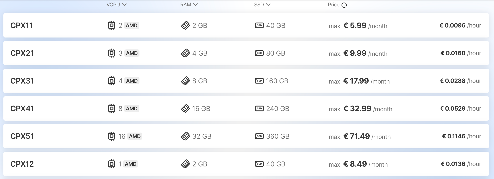
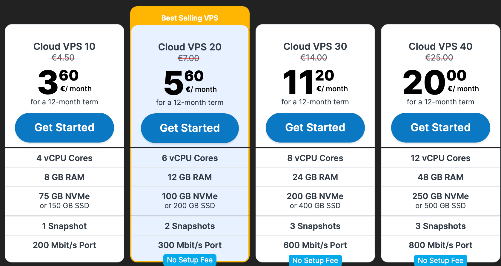
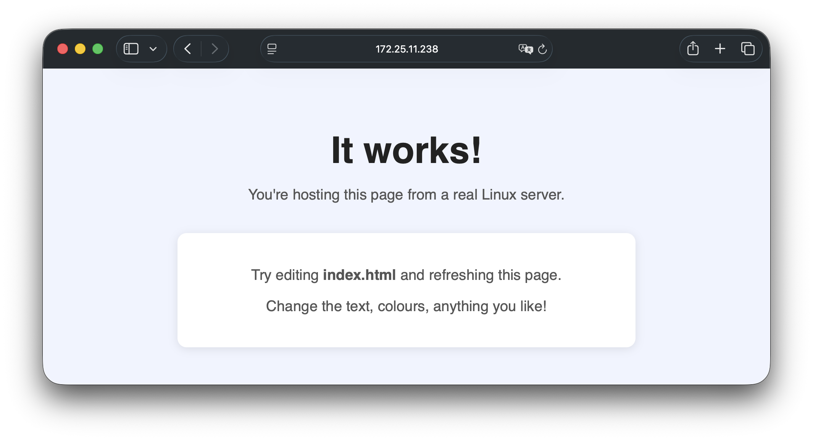
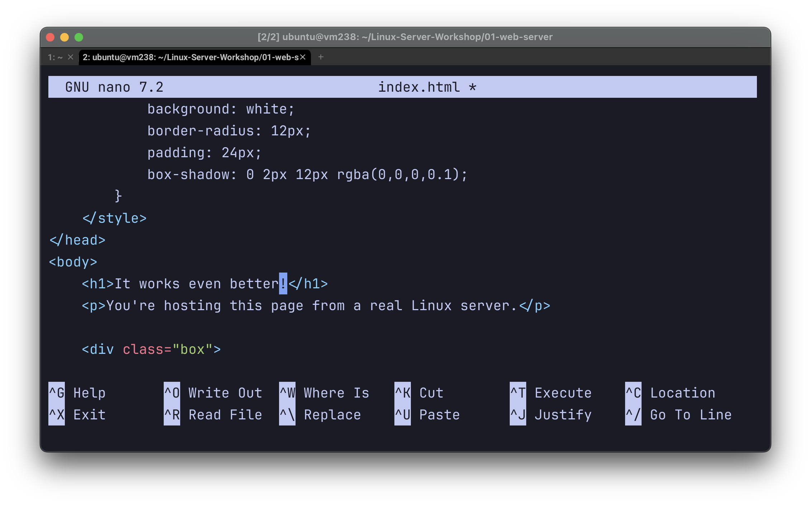
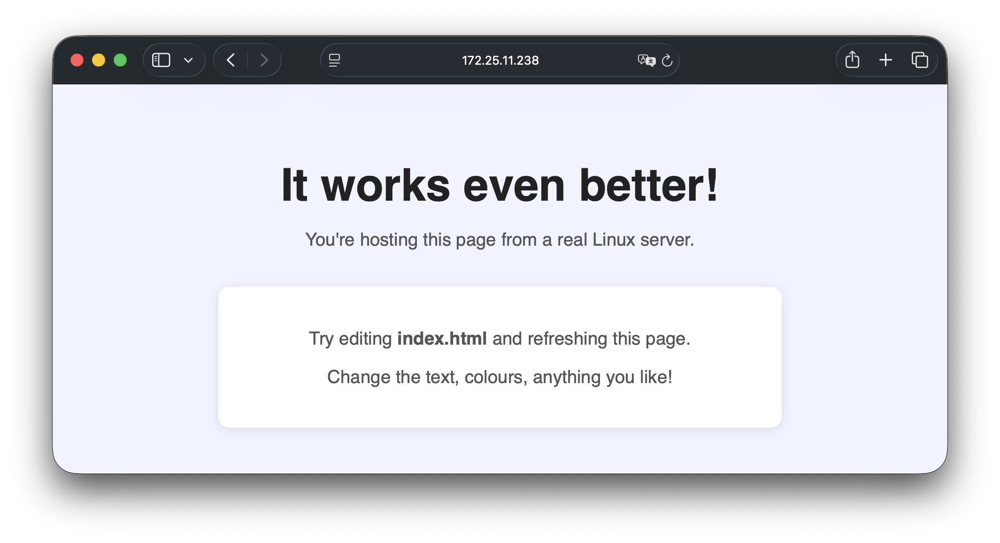

<!-- _class: title -->
<!-- _paginate: false -->

# Linux Server Workshop

Grab your piece of paper. You'll need it soon.

---

## What is a server?

A server is just a computer that is always on, always connected, waiting for other machines to talk to it.


Almost all servers run **Linux**, free, stable, runs without a screen or keyboard attached.

---

## What can you do with a server?

- Host a website or web app
- Run a Discord bot
- Build and expose an API
- Host a game server (Minecraft, Valheim...)
- Store files (your personal google drive)
- Schedule automated tasks and scripts
- Run a database
- Run Docker containers

---

## Where do you get one?

You rent one. A company owns physical machines in a data centre and you pay for a slice of it. This is called a **VPS** (Virtual Private Server).

---

## Hetzner

Probably the best value VPS provider in Europe. Starts around **€5/month**.



---

## Contabo

Cheaper than Hetzner for the specs you get. Less stable but totally fine.

Good pick if you want a lot of RAM or disk on a budget.



---


## You as students also have access to strato

https://strato-new.claaudia.aau.dk/auth/login/?next=/

> These servers have weird network setup, but you can access them outside of uni net with the right network rules.


---

## What we're using today - Please follow along

Servers provided by **SupercomputerClub** running on the university infrastructure.

You were handed a piece of paper with an IP and a password. That's all you need.


> These servers have **private IPs** - only reachable on the university network. Relevant when we talk about domains later.

---

## What is SSH?

SSH lets you open a terminal on a remote machine over the network. When you type a command, it runs on the server instead of your laptop.

```
$ ssh ubuntu@172.25.11.238
ubuntu@172.25.11.238's password:

Welcome to Ubuntu 24.04.4 LTS (GNU/Linux 6.8.0-106-generic x86_64)

  System load:  0.0               Processes:       129
  Usage of /:   13.3% of 18.33GB  Users logged in: 0
  Memory usage: 9%                IPv4 address:    172.25.11.238

ubuntu@vm238:~$
```

That `$` prompt means you're in. Everything you type now runs on the server.

---

## Connecting - Waiting for everyone to connect


SSH comes installed on every platform.

**Mac / Linux** - open Terminal:
```bash
ssh ubuntu@YOUR_IP_ADDRESS
```

**Windows 11** - open the Terminal app (search in Start menu):
```powershell
ssh ubuntu@YOUR_IP_ADDRESS
```

**Windows 10** - use Command Prompt (cmd):
```
ssh ubuntu@YOUR_IP_ADDRESS
```

Type `yes` if asked about the fingerprint, then enter the password from your paper.

---

<!-- _class: center -->

# Task 01
## Host a webpage

Follow along - everyone does this one together.

---

## Step 1 - SSH in and get the repo

Connect to your server using the IP and password from your paper.

Once you're in, clone the repo:

```bash
git clone https://github.com/DeeKahy/Linux-Server-Workshop.git
cd Linux-Server-Workshop
```

---

## Step 2 - Go into the project folder

```bash
cd 01-web-server
ls
```

You'll see three files:

```
README.md    index.html    server.py
```

`index.html` is the page. `server.py` is what serves it.

---

## Step 3 - Start the server

```bash
python3 server.py
```

```
Serving on http://0.0.0.0:8080
Visit http://YOUR_SERVER_IP:8080 in your browser
Press ctrl+c to stop
```

Leave this running and open a browser on your laptop.

---

## Step 4 - Visit it in your browser

Go to:

```
http://YOUR_SERVER_IP:8080
```

<div class="warn">⚠️ Make sure it's <strong>http://</strong> not https:// - the server doesn't have a certificate so HTTPS won't work.</div>



---

## Step 5 - Edit the page

Stop the server with `ctrl+c`, then open the HTML file:

```bash
nano index.html
```

Change the heading or any text. Save: `ctrl+o` then `ctrl+x`. Start the server again and refresh.

<div class="two-col" style="margin-top:16px;">
<div>



</div>
<div>



</div>
</div>


Note: Almost every editor and ide can connect to a so you can avoid nano entirely.
---

## What just happened?

- `server.py` started Python's built-in HTTP server on port **8080**
- It served `index.html` to any browser that connected
- Your laptop sent a request to the server's IP on that port
- The server sent back the HTML and your browser rendered it

That's the core of how every website on the internet works.

---

## Why we can't do DNS today

Our servers have **private IPs** - they only exist inside the university network. The internet has no way to route to them.

To run a public-facing server with a domain you need:

1. A VPS with a **public IP** - Hetzner or Contabo
2. A **domain** - buy through some free provider or Cloudflare (at cost)
3. Add an **A record** pointing the domain at your IP

Worth trying at home this weekend if you're curious.

---

## Tasks - explore at your own pace

| Task | What |
|------|------|
| 01 - Web server | Done - you just did this |
| 02 - Discord bot | Ping/pong bot, needs a token |
| 03 - systemd service | Run programs as background services |
| 04 - Flask API | Build a REST API with Python |
| 05 - Bash scripting | Write shell scripts |
| 06 - Cron jobs | Schedule tasks |
| **07 - UFW firewall** | **Control which ports are open** |
| **08 - SSH keys** | **Log in without a password** |
| 09 - Auto updates | Keep the server patched |
| 10 - TCP chat | Group chat over the local network |

---

<!-- _class: center -->

# Go explore

Open any task folder and read its `README.md`.

Ask for help any time.

**Task 10 (TCP chat) is a group activity - find us when you want to run it.**
